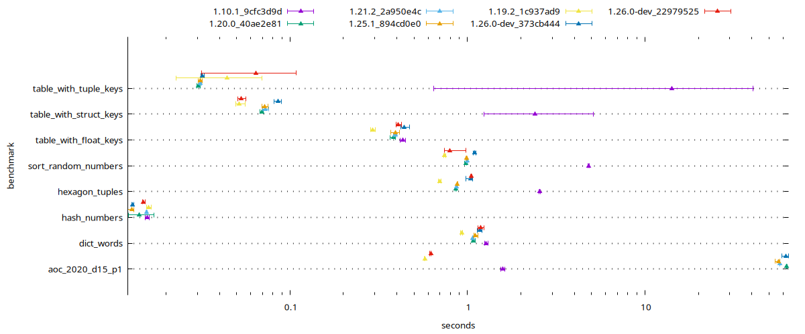

# janet-benchmarks

A suite of benchmarks targeted at exposing performance problems.

## How to read the output

Each benchmark+param is run 3 times and the min/max time spent is printed.
Example when run with version 1.12.2:

```
ver:     1.12.2
build:   b91fe8be

noop
  param=0 ...           min=0.007 max=0.007
hexagon_tuples
  param=50 ...          min=2.677 max=2.717
table_with_tuple_keys
  param="0 200" ...             min=2.500 max=2.543
  param="1000 200" ...          min=0.268 max=0.279
  param="10000 200" ...         min=0.044 max=0.045
  param="100000 200" ...        min=0.016 max=0.017
  param="1000000 200" ...       min=0.059 max=0.061
  param="10000000 200" ...      min=5.503 max=5.647
dict_words
  param=1000000 ...             min=0.387 max=0.403
```

This output shows that the `table_with_tuple_keys` takes much long if the
numbers used are in the range of `0 to 200` or `10,000,000 to 10,000,200`. 

Benchmarks under a heading (eg. `table_with_tuple_keys`) should all do the same
amount of work and take the same amount of time.

## Results

Built with `-O2 -flto` and run on `Intel(R) Core(TM) i7-8650U CPU @ 1.90GHz`.
Names are commits; eg. `2ec12fe0` is  https://github.com/felixr/janet/commit/2ec12fe06f02deb31aec5dd29595c19359623098 and 
`cae4f196` is  https://github.com/janet-lang/janet/commit/cae4f1962914e27aba3d40aa650ac1e63c3c5a9b



